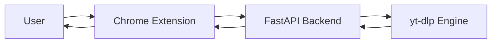

# Save-DLP

<div align="center">

### Download YouTube videos — fast, clean, and native.

Not another shady downloader.
Not another bloated app.
Just one button → instant control.

<br/>


</div>

---

## 🎥 What is Save-DLP?

**Save-DLP** is a browser extension + local backend that lets you:

→ Download videos directly from YouTube
→ Choose quality (480p → 4K)
→ Extract audio (MP3)
→ Track live progress (speed + ETA)
→ Preview and save thumbnails

All without leaving YouTube.

---

## ⚡ Product Experience

> Built to feel instant. Designed to feel native.

* 🔘 One-click **Save button** inside YouTube
* 🎬 Full thumbnail preview + download
* 🎯 Smart format selection (MP4 / MKV / MP3)
* 📊 Real-time progress inside the button
* ⚡ Speed + ETA tracking
* 🧠 Cached formats (instant modal load)
* 🧩 Shadow DOM UI (no YouTube CSS conflicts)

---

## ✨ Features

### 🎬 Video Download

* Best quality auto-select
* Manual selection (480p → 2160p / 4K)
* MKV with subtitles support

### 🎵 Audio Extraction

* MP3 (best quality)

### 📊 Real-Time Feedback

* Live progress (%)
* Download speed (MB/s)
* Estimated time remaining

### 🖼️ Thumbnail Tools

* Preview thumbnail
* One-click download

### ⚡ Performance

* Cached video formats
* Instant modal opening
* Smooth UI animations

---

## 🏗️ Architecture



---

## 🧠 How It Works

1. User clicks **Save**
2. Extension fetches:

   * formats
   * thumbnail
3. User selects quality
4. Backend runs `yt-dlp`
5. Progress streamed → UI updates
6. File downloads automatically

---

## ⚙️ Tech Stack

### Extension

* Vanilla JS
* Shadow DOM (UI isolation)
* Chrome Extension API (Manifest v3)

### Backend

* FastAPI
* yt-dlp
* Subprocess streaming
* Threaded download handling

---

## 📂 Project Structure

```
save-dlp/
│
├── extension/
│   ├── content.js
│   ├── styles.css
│   └── manifest.json
│
├── downloads/
│
├── main.py
├── requirements.txt
├── README.md
```

---

## 🛠️ Setup

### 1. Clone repo

```bash
git clone https://github.com/your-username/save-dlp
cd save-dlp
```

---

### 2. Backend setup

```bash
pip install -r requirements.txt
uvicorn main:app --reload
```

---

### 3. Load extension (Chrome)

1. Go to `chrome://extensions`
2. Enable **Developer Mode**
3. Click **Load unpacked**
4. Select `/extension` folder

---

## 🚀 Usage

1. Open any YouTube video
2. Click **Save**
3. Choose:

   * Format
   * Quality
4. Hit download
5. Done.

---

## 📌 Roadmap

* Firefox support
* Background downloads (no local server)
* Download history
* Batch downloads
* UI polish (Magic UI integration)

---

## 🤝 Contributing

PRs welcome.

---

## 📄 License

MIT