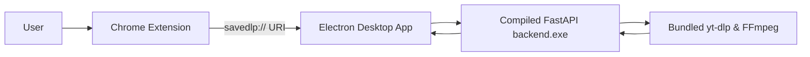

# Save-DLP

<div align="center">

### Download YouTube videos — fast, clean, and native.

Not another shady downloader website.  
Not another bloated command-line wrapper.  
Just one extension button → seamless desktop integration.

<br/>


</div>

---

# 🎥 What is Save-DLP?

**Save-DLP** is a seamless two-part system: a lightweight Chrome Extension and a powerful Desktop Application.

Together, they let you:

- Download videos directly from the YouTube interface  
- Choose precise qualities (480p up to 4K)  
- Extract high-fidelity audio (MP3/WAV)  
- Manage download history and custom save paths  
- Leverage the raw speed of `yt-dlp` without ever opening a terminal  

No Python installation required.  
No Node.js required.  
Everything is pre-packaged.

---

# ⚡ Product Experience

> Built to feel instant. Designed to feel native.

## Features

### One-Click Extension
A sleek **Save** button injected directly into the YouTube player.

### Deep Linking Protocol
Clicking **Download** in the browser instantly wakes up the desktop app via:

```text
savedlp://
```

### Zero Configuration

Bundled:

- yt-dlp  
- FFmpeg  
- FastAPI backend  

No setup needed.

### Modern UI

Built with:

- React  
- Dark Mode  
- Real-time progress tracking  
- Smooth animations  

### Desktop Native

Includes:

- System notifications  
- Native file explorer integration

---

# ✨ Features

## 🎬 Video & Audio Engine

- Best quality auto-select or manual override (up to 2160p / 4K)  
- MP4, WebM, MKV support  
- Subtitle embedding  
- MP3 & WAV extraction  
- One-click thumbnail (PNG) extraction  

---

## 📊 Desktop Management

- Live progress bars  
- ETA tracking  
- Download speed metrics (MB/s)  
- Persistent history  
- Custom save folders  

---

## ⚡ Performance

- Cached video formats for instant modal rendering  
- Compiled FastAPI standalone backend  
- Shadow DOM UI isolation for YouTube compatibility

---

# 🏗️ Architecture



---

# 🧠 How It Works

1. Click **Save** on any YouTube video.

2. Extension fetches format options and displays a clean UI overlay.

3. Select desired quality or format.

4. Extension triggers:

```text
savedlp://
```

5. Electron desktop app wakes up automatically.

6. Data passes into invisible Python backend.

7. Bundled yt-dlp + FFmpeg process the media.

8. Progress streams back into React UI.

---

# ⚙️ Tech Stack

## Desktop Application

- Frontend: React + Vite  
- Framework: Electron  
- Packaging: Electron Builder (NSIS)

---

## Backend Engine

- FastAPI  
- yt-dlp  
- FFmpeg  
- PyInstaller

---

## Browser Extension

- Vanilla JavaScript  
- Shadow DOM  
- Chrome Extension API (Manifest V3)

---

# 📂 Project Structure

```text
save-dlp/
│
├── app/                 
│   ├── src/
│   ├── main.js
│   └── preload.js
│
├── backend/
│   ├── bin/
│   ├── dist/
│   └── main.py
│
├── extension/
│   ├── content.js
│   ├── manifest.json
│   └── styles.css
│
└── release/
```

---

# 🛠 Installation (End Users)

1. Download latest installer:

```text
SaveDLP Setup 1.0.0.exe
```

2. Run installer.

3. Open:

```text
chrome://extensions/
```

4. Enable **Developer Mode**

5. Click **Load unpacked**

6. Select extension folder:

```text
%localappdata%\Programs\savedlp\resources\extension
```

---

# 💻 Setup (Developers)

## Clone Repo

```bash
git clone https://github.com/ayusht26/save-dlp
cd save-dlp
npm install
```

---

## Compile Backend

```bash
cd backend

python -m pip install -r requirements.txt

python -m PyInstaller \
--name backend \
--onefile \
--noconsole \
--add-data "bin/*;bin" \
--hidden-import="uvicorn.logging" \
--hidden-import="uvicorn.loops" \
--hidden-import="uvicorn.loops.auto" \
--hidden-import="uvicorn.protocols" \
--hidden-import="uvicorn.protocols.http" \
--hidden-import="uvicorn.protocols.http.auto" \
--hidden-import="uvicorn.protocols.websockets" \
--hidden-import="uvicorn.protocols.websockets.auto" \
--hidden-import="uvicorn.lifespan" \
--hidden-import="uvicorn.lifespan.on" \
main.py

cd ..
```

---

## Build Windows Installer

```bash
npm run build:win
```

---

# 📌 Roadmap

- Firefox `.xpi` support  
- macOS `.dmg` support  
- Linux `.AppImage` builds  
- Playlist downloading  
- Advanced metadata editing  

---

# 🤝 Contributing

Pull requests are welcome.

---

# 📄 License

MIT