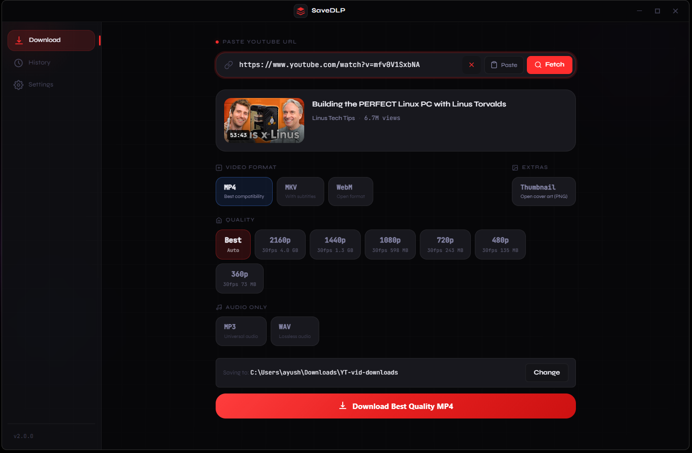
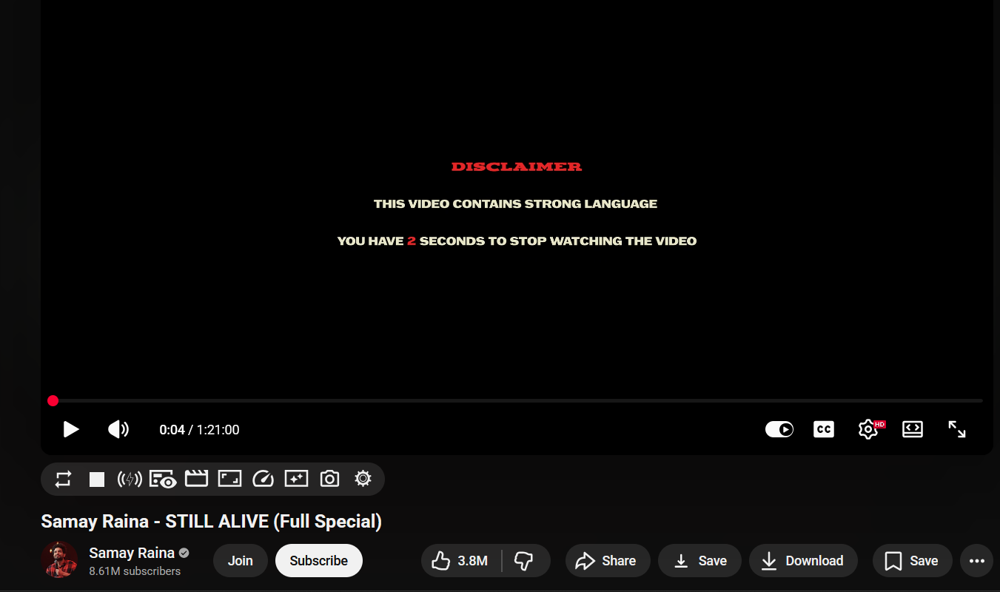
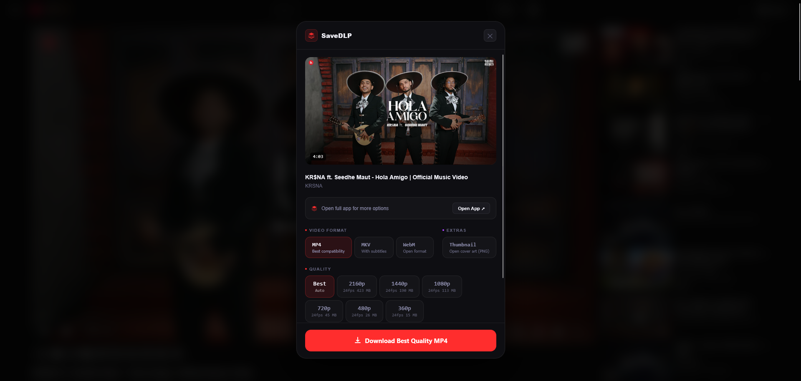
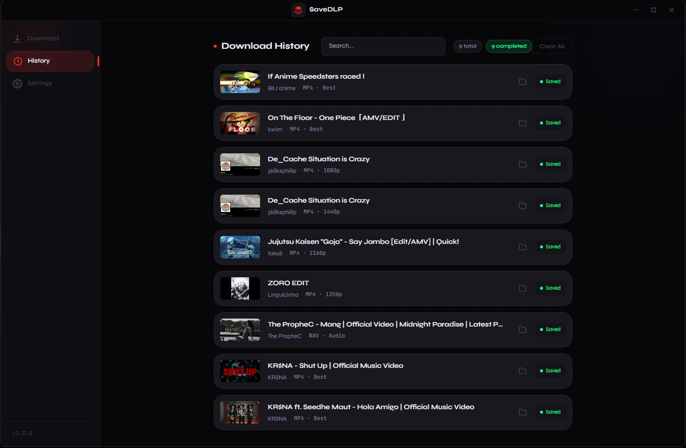
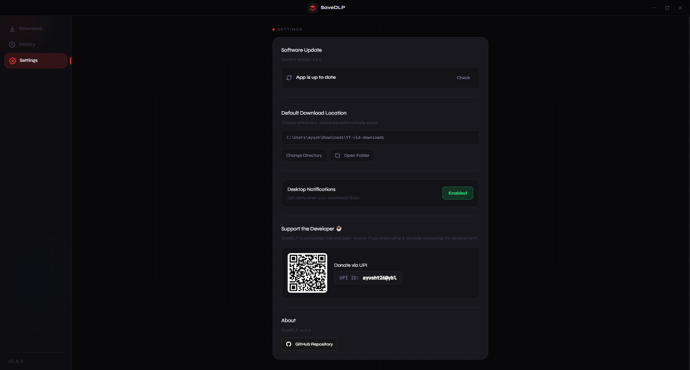
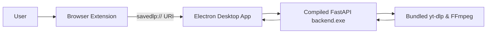

# Save-DLP

<div align="center">

### Download YouTube videos — fast, clean, and native.

Not another shady downloader website.  
Not another bloated command-line wrapper.  
Just one extension button → seamless desktop integration.

<br/>


<br/>



</div>

---

# 🎥 What is Save-DLP?

**Save-DLP** is a seamless two-part system: a lightweight Browser Extension and a powerful Desktop Application.

Together, they let you:

- Download videos directly from the YouTube interface  
- Choose precise qualities (480p up to 4K)  
- Extract high-fidelity audio (MP3/WAV)  
- Manage download history and custom save paths  
- Leverage the raw speed of `yt-dlp` without ever opening a terminal  

No Python installation required.  
No Node.js required.  
Everything is pre-packaged.

---

# 🎉 What's New in v2.0.0

Version 2.0.0 transforms SaveDLP into a premium, commercial-grade desktop client:

- **🔄 Over-The-Air (OTA) Updates**  
  Check for, download, and install future application updates directly from Settings.

- **✨ Magic UI Notifications**  
  Framer Motion-powered animated toasts track download states.

- **🚀 Intelligent Engine Boot**  
  “Waking up Engine” UI synchronizes React frontend with Python backend.

- **🦊 Firefox Support**  
  Official signed `.xpi` support.

- **💅 Native UI Polish**  
  Tailwind CSS, custom focus rings, and streamlined inputs.

---

# ⚡ Product Experience

> Built to feel instant. Designed to feel native.

## 🌐 One-Click Browser Integration

A sleek **Save** button injected into the YouTube player.

Clicking it wakes the desktop app via custom `savedlp://` deep link.

<div align="center">


</div>

---

## 🎬 Powerful Download Engine

Choose exact container, quality and audio preferences.

<div align="center">

</div>

---

## 📊 Download History

Persistent dashboard for active queues and completed downloads.

<div align="center">

</div>

---

## ⚙️ OTA Settings & Management

Manage folders, notifications and updates.

<div align="center">

</div>

---

# ✨ Core Features

## 🎬 Video & Audio Processing

- Best quality auto-select or manual override (up to 2160p / 4K)  
- MP4, WebM, MKV support  
- Subtitle embedding  
- MP3 & lossless WAV extraction  
- One-click thumbnail extraction  

## 📊 Desktop Management

- Live progress bars  
- ETA tracking  
- Download speed metrics  
- Native system notifications  
- Custom save folders  

## ⚡ Performance

- Cached video formats for instant modal rendering  
- Compiled FastAPI standalone backend  
- Shadow DOM UI isolation in extension  

---

# 🏗️ Architecture



---

# ⚙️ Tech Stack

## Desktop Application

- Frontend: React + Vite  
- Styling/UI: Tailwind CSS + Framer Motion  
- Framework: Electron  
- Packaging: Electron Builder (NSIS)  

## Backend Engine

- Server: FastAPI  
- Core: yt-dlp + FFmpeg  
- Compiler: PyInstaller  

## Browser Extension

- Vanilla JavaScript + Shadow DOM  
- Chrome Extension API (Manifest V3)  

---

# 🛠 Installation (End Users)

## Step 1 — Install Desktop App

Download:

`SaveDLP-Setup-2.0.0.exe`

Run installer.

It will:

- Install app  
- Create shortcut  
- Launch background engine  

---

## Step 2 — Install Browser Extension

### Chrome / Brave / Edge

Go to:

```text
chrome://extensions/
```

Enable **Developer Mode**

Click:

```text
Load unpacked
```

Select:

```text
%localappdata%\Programs\savedlp\resources\extension
```

---

### Firefox

Download:

```text
SaveDLP-Firefox-v2.0.0.xpi
```

Drag it into Firefox and click **Add**.

---

# 💻 Setup (Developers)

## 1. Clone Repo

```bash
git clone https://github.com/ayusht26/save-dlp
cd save-dlp
npm install
```

---

## 2. Compile Backend

```bash
cd backend

python -m pip install -r requirements.txt

python -m PyInstaller \
--name backend \
--onefile \
--noconsole \
--add-data "bin/*;bin" \
--hidden-import="uvicorn.logging" \
--hidden-import="uvicorn.loops" \
--hidden-import="uvicorn.loops.auto" \
--hidden-import="uvicorn.protocols" \
--hidden-import="uvicorn.protocols.http" \
--hidden-import="uvicorn.protocols.http.auto" \
--hidden-import="uvicorn.protocols.websockets" \
--hidden-import="uvicorn.protocols.websockets.auto" \
--hidden-import="uvicorn.lifespan" \
--hidden-import="uvicorn.lifespan.on" \
main.py

cd ..
```

---

## 3. Build Windows Installer

```bash
npm run build:win
```

---

# 📌 Roadmap

- macOS `.dmg` support  
- Linux `.AppImage` builds  
- Batch playlist downloading  
- Advanced metadata editing  

---

# 🤝 Contributing

Pull requests are always welcome.

---

# 📄 License

MIT
